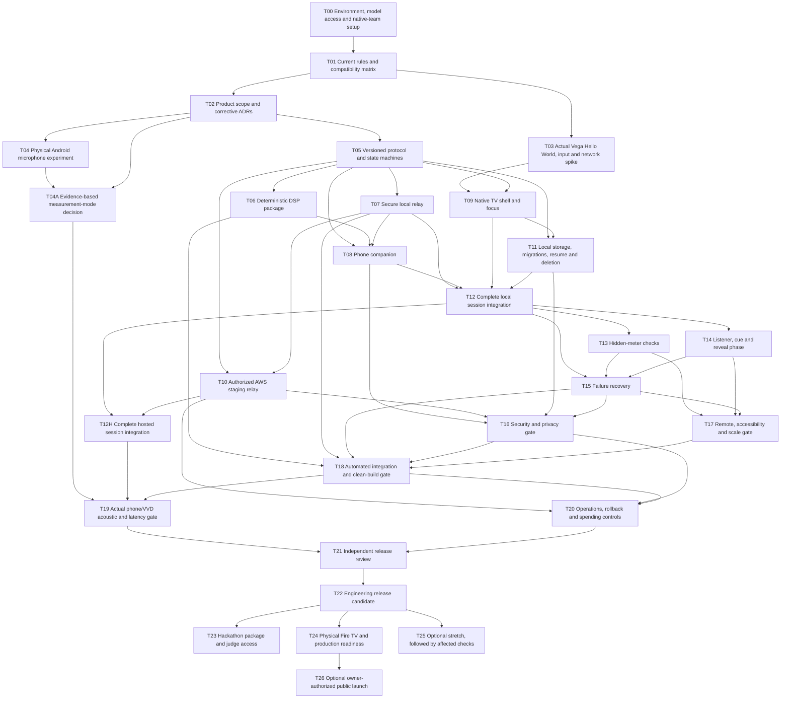

# Task graph (Mermaid)

Generated from `.build/task-graph.json`. Edges point from dependency to dependent.

```mermaid
flowchart TD
  T00["T00 Environment, model access and native-team setup"]
  T01["T01 Current rules and compatibility matrix"]
  T02["T02 Product scope and corrective ADRs"]
  T03["T03 Actual Vega Hello World, input and network spike"]
  T04["T04 Physical Android microphone experiment"]
  T04A["T04A Evidence-based measurement-mode decision"]
  T05["T05 Versioned protocol and state machines"]
  T06["T06 Deterministic DSP package"]
  T07["T07 Secure local relay"]
  T08["T08 Phone companion"]
  T09["T09 Native TV shell and focus"]
  T10["T10 Authorized AWS staging relay"]
  T11["T11 Local storage, migrations, resume and deletion"]
  T12["T12 Complete local session integration"]
  T12H["T12H Complete hosted session integration"]
  T13["T13 Hidden-meter checks"]
  T14["T14 Listener, cue and reveal phase"]
  T15["T15 Failure recovery"]
  T16["T16 Security and privacy gate"]
  T17["T17 Remote, accessibility and scale gate"]
  T18["T18 Automated integration and clean-build gate"]
  T19["T19 Actual phone/VVD acoustic and latency gate"]
  T20["T20 Operations, rollback and spending controls"]
  T21["T21 Independent release review"]
  T22["T22 Engineering release candidate"]
  T23["T23 Hackathon package and judge access"]
  T24["T24 Physical Fire TV and production readiness"]
  T25["T25 Optional stretch, followed by affected checks"]
  T26["T26 Optional owner-authorized public launch"]
  T00 --> T01
  T01 --> T02
  T01 --> T03
  T02 --> T04
  T04 --> T04A
  T02 --> T04A
  T02 --> T05
  T05 --> T06
  T05 --> T07
  T05 --> T08
  T06 --> T08
  T07 --> T08
  T03 --> T09
  T05 --> T09
  T05 --> T10
  T07 --> T10
  T05 --> T11
  T09 --> T11
  T07 --> T12
  T08 --> T12
  T09 --> T12
  T11 --> T12
  T12 --> T12H
  T10 --> T12H
  T12 --> T13
  T12 --> T14
  T12 --> T15
  T13 --> T15
  T14 --> T15
  T08 --> T16
  T10 --> T16
  T11 --> T16
  T15 --> T16
  T13 --> T17
  T14 --> T17
  T15 --> T17
  T06 --> T18
  T07 --> T18
  T15 --> T18
  T16 --> T18
  T17 --> T18
  T04A --> T19
  T12H --> T19
  T18 --> T19
  T10 --> T20
  T16 --> T20
  T18 --> T20
  T19 --> T21
  T20 --> T21
  T21 --> T22
  T22 --> T23
  T22 --> T24
  T22 --> T25
  T24 --> T26
```

Edges: 54. Tasks: 29.
